# 《灌篮高手手游》的设计分析

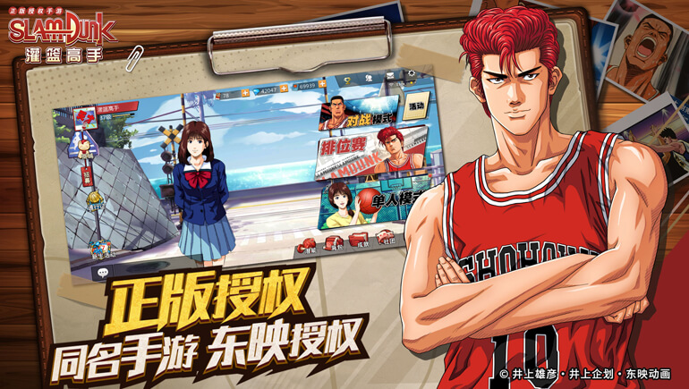

## 游戏简介

《灌篮高手正版授权手游》是一款真人实时篮球竞技手游，由蛙扑发行,先知者研发，东映动画授权并全程监制。游戏将以多样的比赛模式和剧情还原《灌篮高手》赋予我们的热血时代,一圆你我曾经"称霸全国"的梦想!

## 游戏玩法

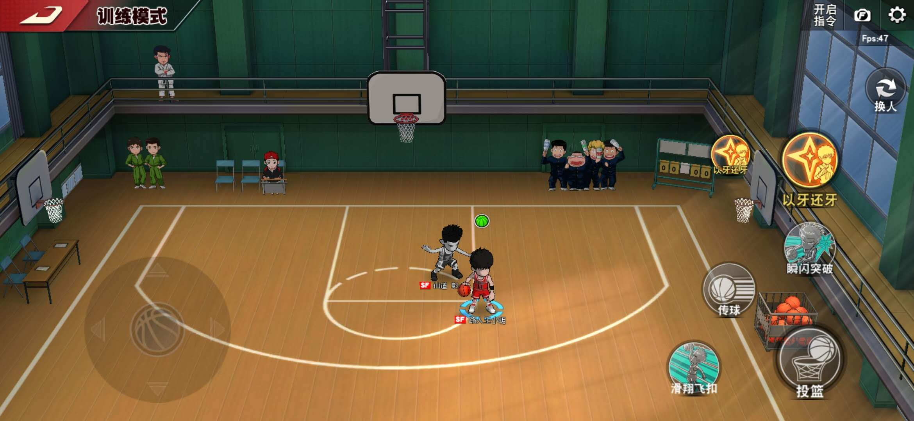

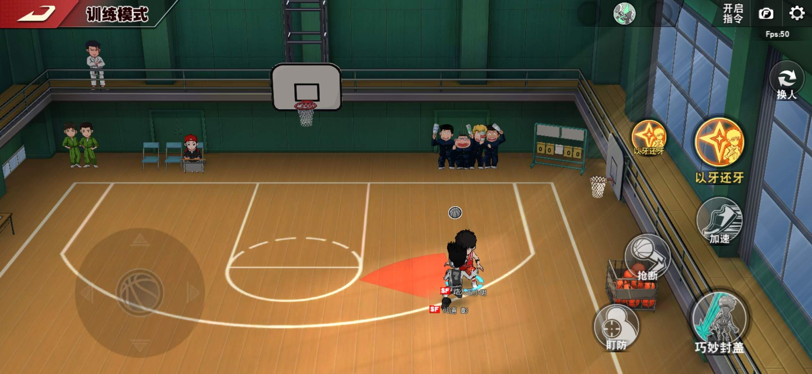

身为一款篮球竞技手游，在操作上却跟传统的篮球类手游有着较大的区别。

首先，这款游戏在操作上面引入了“技能”这一说法，每一个球员的每一个技能的设计在原著里面也都是有相应的出处的，每个球员各有所长，有的擅长抢断有的擅长盖帽。这在我看来是一个较为成功的设计，以往的篮球游戏大抵都是相类似的操作方式，不同的只是人物模型跟游戏场景，换汤不换药。而《灌篮高手》中的操作由一个个技能的释放来实现，在一定程度上增加了手机上操作的趣味性，毕竟手机操作跟手柄操作亦或是键盘操作还是有着较大区别的；再加上Q版的人物模型，在夸张之余又不失真，在篮球手游中成为一种较为“另类”的存在，颇有一种篮球竞技领域的“王者荣耀”的味道。

因而，基于技能释放的篮球游戏、以及Q版的人物模型、再加上《灌篮高手》所固有的人气和情怀，《灌篮高手手游》在上线初期就吸引了一大批的人群，包括尹正、甚至是郭艾伦。（ps：注意强调是上线初期）

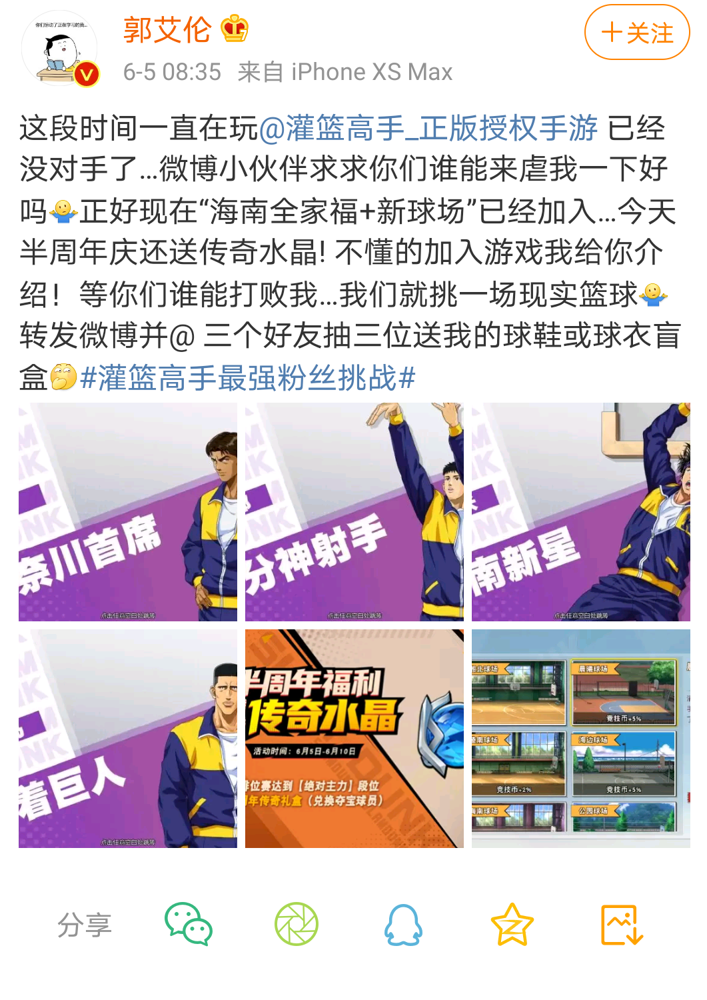
    
同时，身为同款类型游戏的《街篮》，也逐渐地往这类操作模式（玩法）发展。

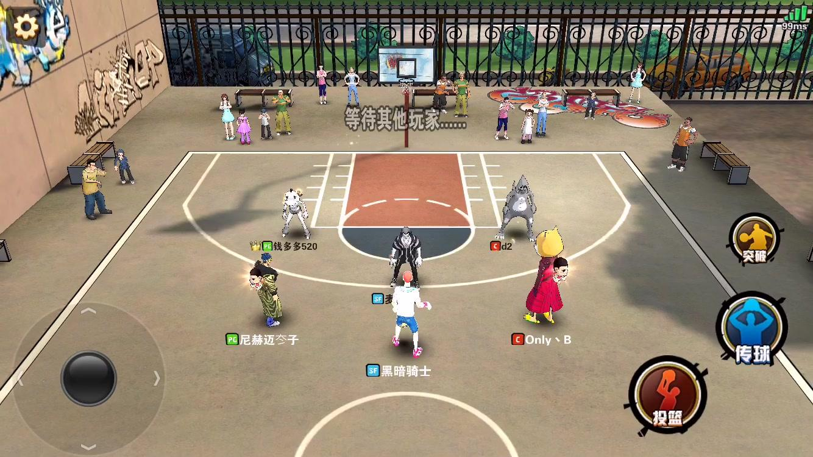

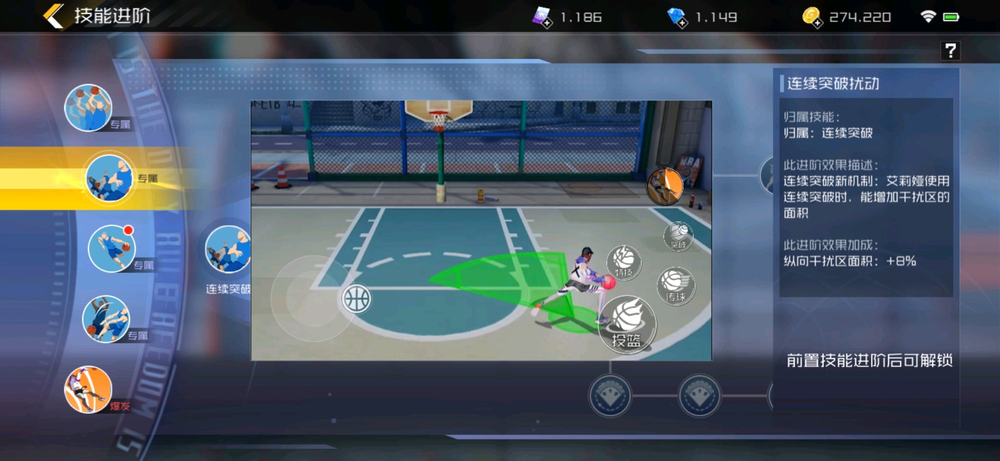

（上图1为街篮1，图2为街篮2。）

## 游戏模式

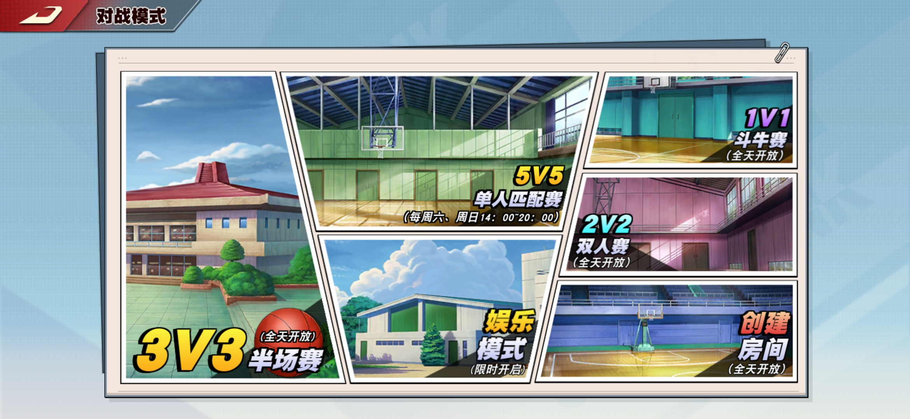

游戏模式倒是挺丰富的，1V1、2V2、半场3V3、全场3V3、全场5V5应有尽有，玩家大可根据自己的喜好去选择自己最喜爱的模式。甚至还可以约几个朋友，创建一个房间，相互切磋切磋、交流交流，这也是一件很有意思的事情。

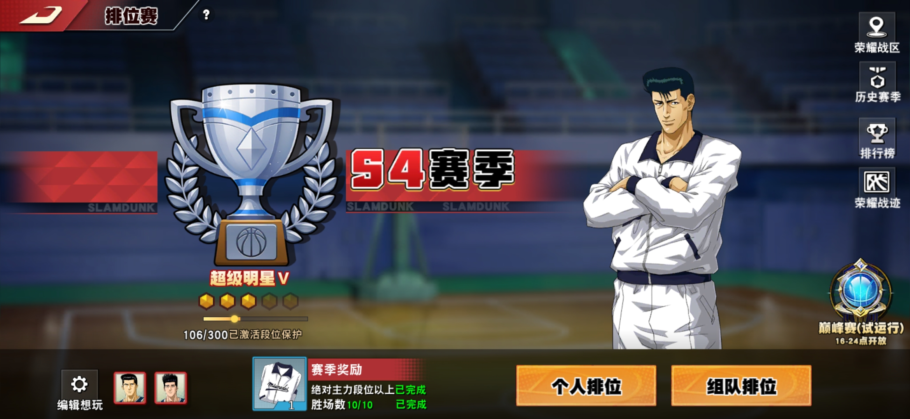

不过，这游戏最富挑战性的还是排位模式，虽然评判一个人的技术水平并不能够简单地看他的段位。高段位的不一定就是大神（可以依靠一系列代打、买号等手段来获取高段位）；低段位的也一样不一定就是菜鸡（可以是大神玩的小号）。但是这个上分的过程还是挺富有挑战性的，一昧得玩匹配模式很快就会失去乐趣，而只有排位模式才能不断地给玩家带来各种各样地挑战。有挑战，游戏的乐趣才能长久；一旦失去挑战，游戏的乐趣也将随之消散了。

而我就是一个实打实的菜鸡了，一直上不了高段位。

不过有一说一，组排的效率跟单排的效率相比简直就是天壤之别，单排真的及其看运气，像我这种非酋就是什么奇葩队友都能遇到。

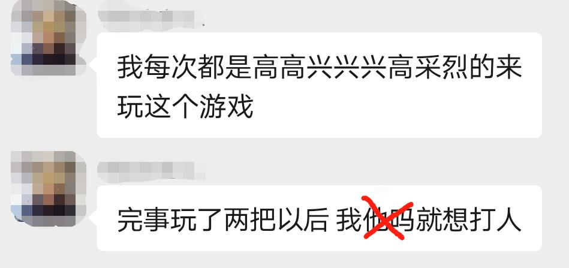

## 游戏特色

**一、一代人的情怀及其所蕴含的精神**

《灌篮高手》不仅仅是一代人的青春回忆，它所蕴涵精神即便是现在也依然极具感染力。漫画中一个个有血有肉的人物形象都在这里重现，又怎么能不让人激动呢？

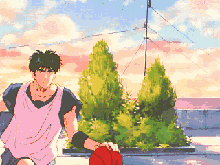

曾经多少人沉醉于流川枫华丽的球技之下。

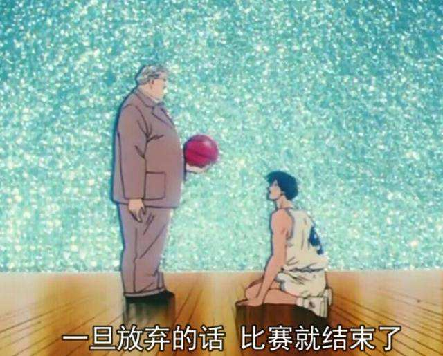

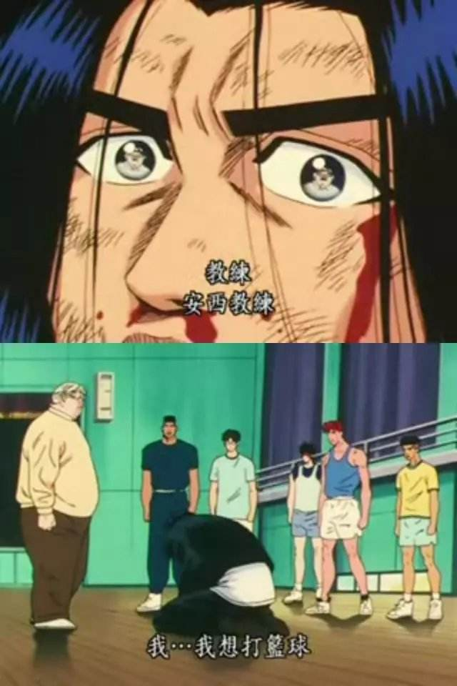

又有多少人被三井寿绝不认输精神和浪子回头的决心所打动。尽管我不是那个年代了，在现在我对这部动漫仍旧是一腔热血。

因此，承载了如此多的《灌篮高手》，在出正版授权手游之时，能吸引一大批玩家也是理所应当的。

更重要的是，在游戏里面还能够切实地“扮演”自己的“偶像”，以现实中所拥有不了的能力，去实现原著中的各种动作、情节，没有什么比这更加振奋人心的了。

**二、团队配合的快感**

篮球并不是一个人的运动，他是一种多人运动。因而，要想取得胜利的话，就必须要懂得信任自己的队友、配合自己的队友。

在防守端，注意好协防，并不是光人盯人就行了。偶尔漏漏人是挺正常的事，注重好区域协防，在留意自己对位球员的同时也时刻做好补防的准备，那样的话团队整体的防守将会更加稳固。

在进攻端的话，则是需要有一个大局观，不能光顾着自己得分，在自己得分的同时还需要帮助队友得分。可以这么说，一个好球员并不在于他能够得多少分，而在于在自己得分的同时他还能够怎么协助队友得分。

而且，不到最后绝不轻言放弃的精神在游戏里面也能有充分的体现，没有什么比团队中每个人相互配合，实现绝杀更令人兴奋的了。

这是这游戏里最主要的两大特色，光凭着这两点，就足以把《灌篮高手》的忠实粉丝给吸引过来了。然而，游戏里还远不止这些，还有球衣、头像、球场等情怀所在，需要入坑之后才更能深刻体会（疯狂暗示）。

## 在创新中继续谋求进步

这游戏在上线初期所造成的成就是不可否认的，但是，不知从何时开始，或许是换了策划的缘故，这游戏就在“良心”的路上越走越远，甚至还有割韭菜之嫌。

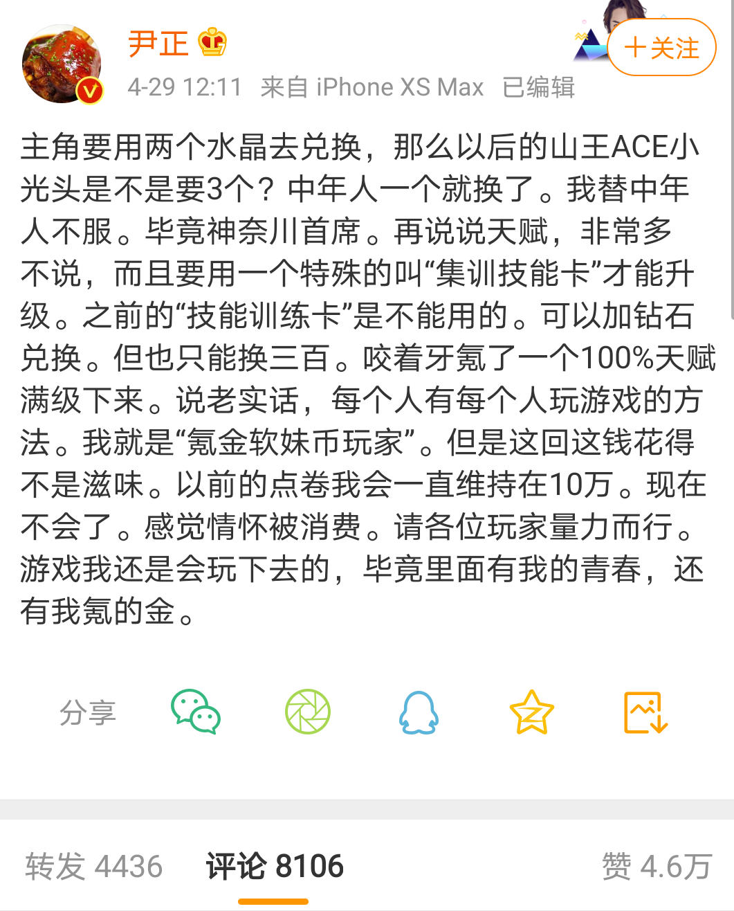

从第一个进阶球员（寸头樱木）开始，一把就将球员的培养成本上升了好几个档次。

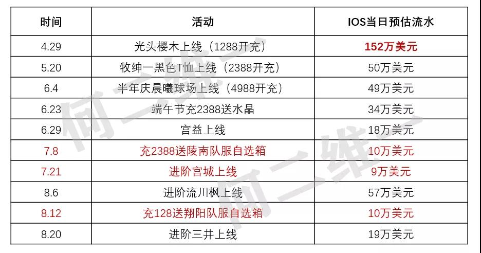

同时，随之上线的“救世主”头像也将充值金额首次提高到了1288，从此开辟了1288、2388、4988的充值新潮。可谓是“前期有多么良心，后期就有多么氪金”。

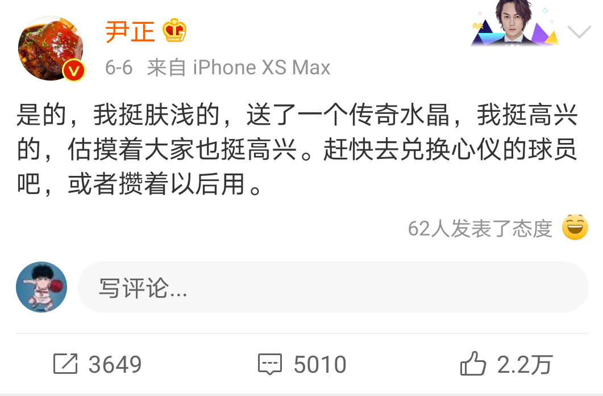

尽管后期也有相应的福利，但也逐渐失去了原来的味道。

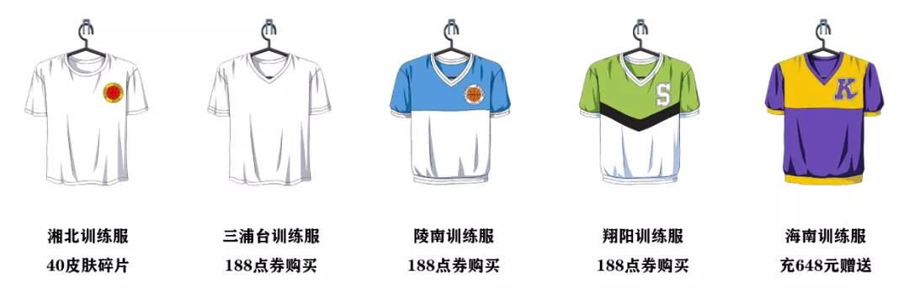

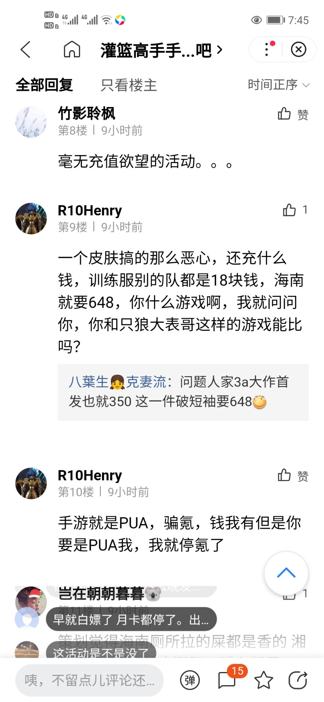

伴随着教师节活动上线的海南训练服同样也以超乎寻常的价格引起了大量玩家的不满。可以这么说，虽大量人都愿意为情怀买单，但也并不意味着运营能够肆无忌怛地一次次将玩家的情怀定价在一个高贵的价格之上。

充值活动不要紧，最影响游戏体验的是球员的平衡。可以这么说，每次上线的新球员都是天花板级别的人物，这严重破坏了游戏的平衡，甚至是劝退玩家。

在这里我推荐两篇文章：

[灌篮高手手游：当情怀落去，只剩一地鸡毛（游戏衰败史第一部）](https://www.toutiao.com/i6859236485854396942/)

[灌篮高手手游：当尹正、郭艾伦们纷纷离开，问题究竟出在哪里](https://www.toutiao.com/i6860094999225500167/)

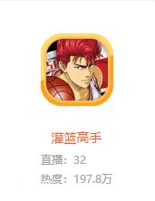

斗鱼直播专区也已经失去了原来的繁华热闹。在我看来，这游戏的初心是美好的，但依靠充值活动、球员强度失衡、系统局等来恶心玩家是没有必要的。对于一个游戏运营来说，在一系列的挑战面前维持初心，这对于留住老玩家、吸引新玩家，促进游戏的长久发展来说是至关重要的。这也是这游戏逐渐走向衰败的原因所在。